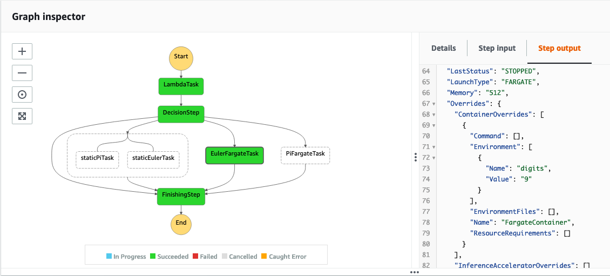

# Step Functions with Fargate Tasks

This project deploys a State Machine using [AWS Step Functions](https://docs.aws.amazon.com/step-functions/latest/dg/welcome.html), [AWS Lambda](https://docs.aws.amazon.com/lambda/latest/dg/welcome.html) and [AWS Fargate](https://docs.aws.amazon.com/AmazonECS/latest/developerguide/AWS_Fargate.html) backed [Amazon Elastic Container Service (ECS)](https://docs.aws.amazon.com/AmazonECS/latest/developerguide/Welcome.html) via [AWS Cloud Development Kit (CDK)](https://aws.amazon.com/cdk/). 

## Setup

  1. Install CDK globally: `npm install -g aws-cdk`
  2. Install local Node.js dependencies: `npm install`
  3. Build the project: `npm run build`
  4. Bootstrap the CDK Toolkit into your AWS account: `cdk bootstrap`
  5. Deploy the stack: `cdk deploy -c image-tag=[latest|plain-text]`

## Useful Commands

  * `npm run build` compile project to `dist`
  * `npm run clean` delete everything in `cdk.out` and `dist`
  * `npm run watch` watch for changes and compile
  * `cdk deploy` deploy this stack to your default AWS account/region
  * `cdk diff` compare deployed stack with current state
  * `cdk synth` emits the synthesized CloudFormation template

## State Machine Description:
(see image below for reference): 

1. You can optionally supply an input of `{"processor": "pi|euler|both|none"}`.
2. The `LambdaTask` will take that input, and invoke a [Lambda task](https://docs.aws.amazon.com/step-functions/latest/dg/connect-lambda.html) synchronously that will output `{"processor": VALUE, "digits": N}` with randomly selected digits and processor (unless you supplied one in step 1).
3. The `DecisionStep` is a [Choice](https://docs.aws.amazon.com/step-functions/latest/dg/amazon-states-language-choice-state.html) and based on the value of `processor`, it will move the state machine to the corresponding step.
   1. If `both` is selected, it will run two [pass](https://docs.aws.amazon.com/step-functions/latest/dg/amazon-states-language-pass-state.html) tasks called `staticPiTask` and `staticEulerTask` in [parallel](https://docs.aws.amazon.com/step-functions/latest/dg/amazon-states-language-parallel-state.html).
   2. If `euler` is selected, it will run an [ECS task](https://docs.aws.amazon.com/step-functions/latest/dg/connect-ecs.html) [synchronously](https://docs.aws.amazon.com/step-functions/latest/dg/connect-to-resource.html#connect-sync) using Fargate and wait until the task completes. 
   3. If `pi` is selected, it will run an [ECS task](https://docs.aws.amazon.com/step-functions/latest/dg/connect-ecs.html) using Fargate as well, but this time it will wait until the task responds to the Step Functions API with the corresponding [TaskToken](https://docs.aws.amazon.com/step-functions/latest/dg/connect-to-resource.html#connect-wait-token). 
   4. Otherwise, it will just continue onto the next step.
4. The FinishingStep is another [pass](https://docs.aws.amazon.com/step-functions/latest/dg/amazon-states-language-pass-state.html) step just to show how to bring all of the different pathways back together. 

#### Notes:
+ The reason for running an ECS Task within a state machine with the [TaskToken](https://docs.aws.amazon.com/step-functions/latest/dg/connect-to-resource.html#connect-wait-token), instead of [synchronously](https://docs.aws.amazon.com/step-functions/latest/dg/connect-to-resource.html#connect-sync), is that it allows you to return data to the state machine. The synchronous process does not let you do this when running ECS Tasks. 
+ When running the state machine, click on the `PiFargateTask` and compare the step output to the `EulerFargateTask` to see the difference in outputs.
  + Euler
  
  + Pi
  

